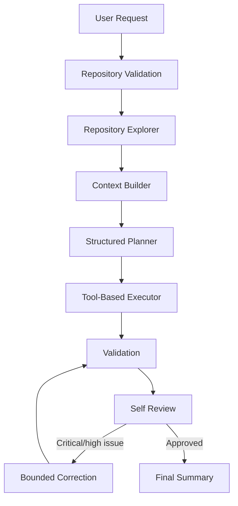

# Repository-Aware AI Coding Agent

This submission contains a reusable Python 3.11+ coding agent and a clearly separated
working copy of CalliCoder's Node.js EasyNotes API. The agent explores unfamiliar
repositories progressively, creates a typed plan, edits through restricted tools,
validates, reviews, performs at most two implementation/correction passes, and writes
an auditable run bundle.

## Architecture



`agent/orchestrator.py` owns deterministic state transitions. The explorer builds a
typed repository summary, while the context builder reads manifests, entry points,
and relevant files until a character budget is reached. The provider interface keeps
model access replaceable. The executor exposes only confined filesystem, patch, Git,
search, and allowlisted command tools. Every invocation is recorded as JSONL.

The whole repository is deliberately not sent to the model: context grows from tree
and manifests through entry points, architectural layers, request-term matches, and
import-related files. This reduces cost, distraction, and accidental secret exposure.

## Installation

Requires Python 3.11+ and Node.js 18+.

```bash
python -m venv .venv
```

Windows:

```powershell
.venv\Scripts\activate
python -m pip install -e ".[dev]"
```

macOS/Linux:

```bash
source .venv/bin/activate
python -m pip install -e ".[dev]"
```

Then:

```bash
cd target-app/node-easy-notes-app
npm install
cd ../..
```

Copy `.env.example` to `.env`, set `OPENAI_API_KEY`, and select a model. Real keys
must never be committed. Missing credentials produce a clear failure before a model
run; `inspect` and `validate` do not need a key.

## Usage

```bash
python main.py inspect --repo ./target-app/node-easy-notes-app
python main.py run --repo ./target-app/node-easy-notes-app --request "Improve the application so users can better organise and search their notes." --dry-run
python main.py run --repo ./target-app/node-easy-notes-app --request "Improve the application so users can better organise and search their notes."
python main.py validate --repo ./target-app/node-easy-notes-app
python main.py show-last-run
```

Useful run options include `--model`, `--provider`, `--max-iterations`,
`--output-dir`, `--verbose/--no-verbose`, and `--non-interactive`.

## Demonstration result

The demonstrated plan selected optional normalized tags, safe title/content search,
single/multiple-tag filtering, allowlisted sorting, bounded pagination, and tag usage
counts. Existing CRUD routes and the legacy array response remain intact. Pagination
metadata is returned in headers. The application uses Jest, Supertest, and an
in-memory MongoDB integration suite; runnable API calls are in
`target-app/node-easy-notes-app/examples/api.http`.

## Testing

```bash
python -m pytest
python -m compileall agent
cd target-app/node-easy-notes-app
npm test
node --check server.js
node --check app/controllers/note.controller.js
node --check app/models/note.model.js
```

## Safety and behavior

Paths are resolved and checked against the approved root, including symlink targets.
Binary and oversized files are rejected. Commands use argument arrays, an executable
allowlist, timeouts, bounded output, and blocked dangerous patterns. Git status and
diff are captured; the agent never pushes or force-resets. Dry-run explores and plans
without repository writes or state-changing commands. Dirty worktrees are warned
about, not overwritten silently.

These controls are defense in depth, not an operating-system sandbox. Production use
should run tools in a disposable container with resource, network, and syscall policy.

## Assumptions and trade-offs

- The target is a backend API; authentication is outside scope.
- Search is keyword-based rather than semantic. Escaped regex is portable for this
  small API, while a database text index is preferable at scale.
- Tags are a lighter, many-to-many organization primitive than hierarchical folders.
- A custom state machine is smaller and more explainable than a large agent framework.
- Bounded autonomy prevents runaway loops at the cost of sometimes requiring a human.
- Mongoose was updated only as needed for maintained Node/test-tool compatibility;
  the Express/CommonJS architecture remains unchanged.

## Limitations and future work

Context selection is heuristic, there is no semantic or AST code index, model output
may vary, and the local command allowlist is not a complete security boundary. A
larger system should add AST symbols and dependency graphs, embeddings, Docker
isolation, approval gates, richer telemetry/evaluation, more providers, and optional
pull-request creation.

## Submission

Initialize the assignment root as its own repository, review the nested target
history decision, then commit:

```bash
git init
git add .
git commit -m "Build repository-aware coding agent assignment"
git branch -M main
git remote add origin <your-submission-repository>
git push -u origin main
```

Do not push automatically from the agent. Put the shareable Google Drive recording
URL in `docs/DEMO_SCRIPT.md` at the marked placeholder.
